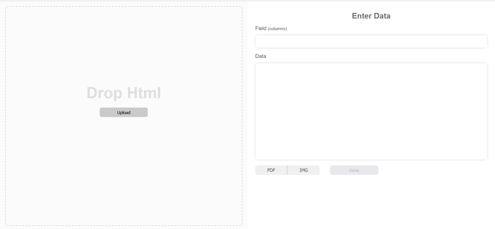

### HTML to IMG applet

This is for educational purposes more than completeness. Might consider adding a simple templater so less knowledge would be needed to use but education so probably not.

### assumtions

The backend assumes you have redis running at `localhost:6379`

### To Run

Create .env in `template-image-maker-frontend` with `REACT_APP_API_URL=[url to backend]`
then

```
npm start
```

### Screenshot


